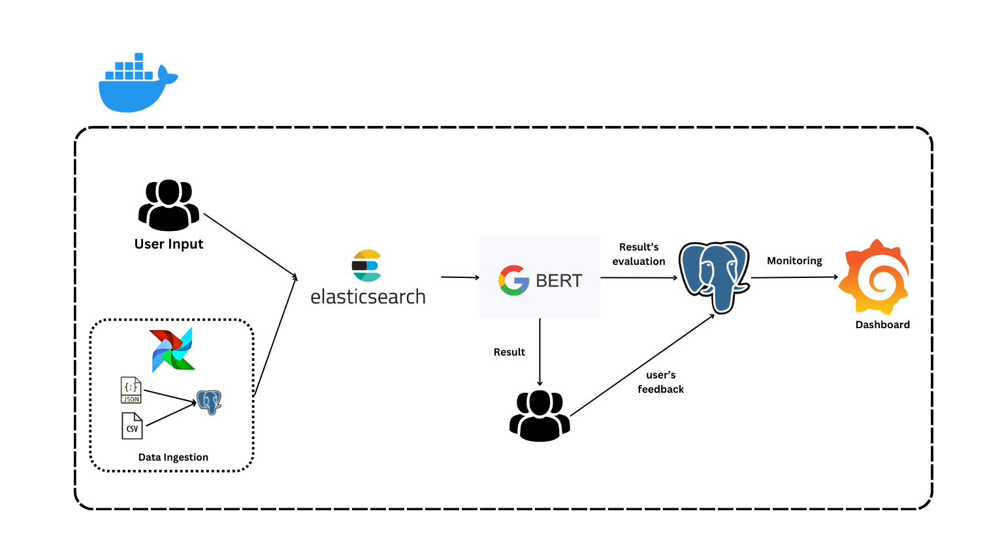
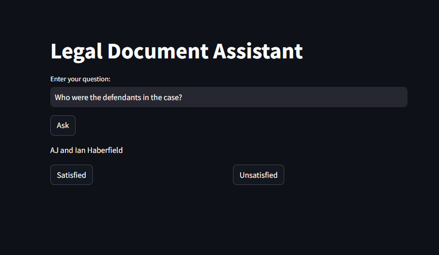
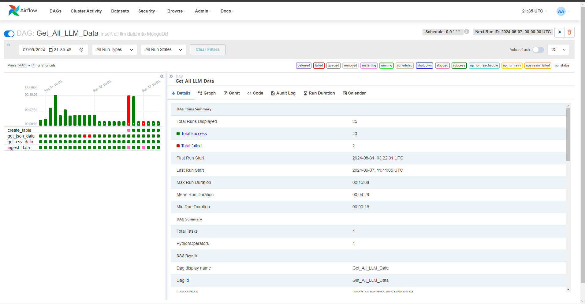
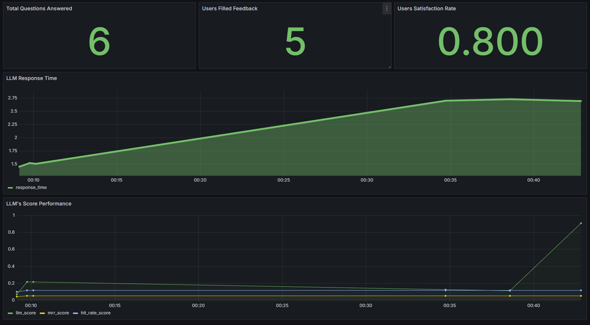

# Legal Document Assistant: Retrieval-Augmented Generation System

## Background

Legal professionals manage vast amounts of legal documents, case law, and statutes. Manually searching through these materials is time-consuming and prone to errors. With advancements in AI and NLP, new solutions have emerged to improve legal research. By leveraging Large Language Models (LLMs) and Retrieval-Augmented Generation (RAG), we can automate legal information retrieval with high accuracy and relevance.

## Problem Statement

Legal professionals face challenges in handling large volumes of documents and case law. Manual search processes are inefficient and risk missing critical information. Existing legal research tools often fail to provide contextually relevant insights. Therefore, there is a need for a solution that can quickly and accurately retrieve legal information.

## Solution

The **Legal Document Assistant** integrates a **Retrieval-Augmented Generation (RAG)** system with a powerful LLM, allowing legal professionals to query large collections of legal documents efficiently. The platform enhances decision-making by linking an LLM to a legal knowledge base, providing accurate, context-driven insights.

---

### RAG Flow



---

### Dataset

- [Australian Legal QA](https://www.kaggle.com/datasets/umarbutler/open-australian-legal-qa/data?select=qa.jsonl)
- [Legal Text Classification Dataset](https://www.kaggle.com/datasets/amohankumar/legal-text-classification-dataset)

---

### Tech Stack

- **Python**: Core programming language for backend services and machine learning models.
- **Streamlit**: Framework for developing the interactive user interface.
- **Airflow**: Automates workflows for data ingestion and processing.
- **Elasticsearch**: Distributed search engine for fast, scalable retrieval.
- **Google BERT LLM**: Enhances retrieval with contextually relevant insights.
- **Grafana**: Visualizes performance metrics in real-time.
- **Docker**: Ensures consistent deployment across environments.

---

### Retrieval

The system uses **PostgreSQL** and **Elasticsearch** for query processing:

1. **Data Storage**: Legal documents are stored in PostgreSQL with metadata (case names, statutes, etc.).
2. **Search**: Elasticsearch performs fast, scalable searches, returning ranked results based on relevance.

---

### RAG System

The system uses **Retrieval-Augmented Generation (RAG)** to deliver accurate and contextually relevant results:

1. **Google BERT Integration**: Provides summaries and insights via Hugging Face API.
2. **API Key Integration**: Use the Hugging Face API key for authentication.

---

### Interface



- **Query Input**: Enter legal queries for processing.
- **Ask Button**: Submits queries, retrieves documents, and generates summaries.
- **Feedback Button**: Allows users to provide feedback on results.

---

### Ingestion Pipeline



The **Apache Airflow** pipeline handles ETL (Extract, Transform, Load) for legal documents:

1. **Data Extraction**: Retrieves data from CSV and JSON files.
2. **Data Loading**: Cleansed data is loaded into PostgreSQL.
3. **Data Indexing**: Data is indexed in Elasticsearch for retrieval.

---

### RAG Evaluation Metrics

1. **Hit Rate**: Proportion of relevant results for queries.
2. **MRR**: Average rank of the first relevant result.
3. **BERT Scores**: Evaluates the quality of generated insights.

---

### Monitoring Dashboard



Key performance metrics are tracked in **Grafana**:

- Total Questions Answered
- User Feedback Collected
- User Satisfaction Rate
- System Response Time

---

## Running the Application

1. **Obtain API Key**: Get a token from Hugging Face ([instructions here](https://huggingface.co/docs/hub/en/security-tokens)).
2. **Add API Key**: Insert the API key into `docker-compose.yml`:
    ```yaml
    app:
      build: llm-app/.
      environment:
        - HUGGINGFACE_KEY=<YOUR_API_KEY>
    ```
3. **Start Containers**: Run `docker-compose up --build -d`.
4. **Access Airflow**: Go to `localhost:8080` (login: `airflow/airflow`) for pipeline management.
5. **Access Streamlit**: Use `localhost:8501` for querying legal information.
6. **Monitor with Grafana**: Track system performance at `localhost:3000`.

---

### Example Queries

1. Why did the plaintiff wait seven months to file an appeal?
2. What was the outcome of the case?
3. Can the landlord avoid liability for disrepair caused by the tenant?
4. What are the details of Commonwealth Bank of Australia's fixed deposit account?
